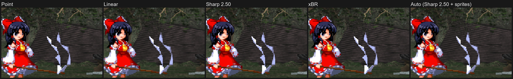

# DisplayManager

A [SWRSToys](https://github.com/SokuDev/SokuMods) mod for Touhou Hisoutensoku (th123) 1.10a that handles fullscreen scaling and window sizing. It is capable of exclusive fullscreen mode with control over visual filters, which can improve display latency by 10-20ms. It is an alternative to WindowResizer: use one or the other, not both.

## Scaling

Fullscreen size (`Mode`):
- `FitToScreen` (default): the largest 4:3 size that fits the screen. Can be a non-integer scale (2.25× on 1080p).
- `IntegerScaling`: a whole-number multiple of 640×480 (`FullscreenScale`), reduced if it doesn't fit.
- `CustomResolution`: an exact size in pixels.

Upscale filter (`Filter`), in fullscreen and, with `WindowedFilter=1` (default), windowed:
- `Sharp` (default): sharp-bilinear with adjustable `Sharpness`. At the default 1.5 it closely matches WindowResizer's look.
- `Point`: hard pixels. Pixels are only even at integer scales.
- `Linear`: bilinear.
- `xBR`: the xBR-lv2 pixel-art upscaler. It smooths diagonal and curved sprite edges and keeps flat areas crisp.

The same frame at ×3 with each filter (a crop at 100%; open the image for full size):

### Sharp sprites (experimental, off by default)

The game itself zooms the characters and the stage with its camera and draws them with hard pixels, so at most zoom levels some sprite pixels come out wider than others and edges crawl while the camera moves. Uncomment `SpriteSharpness` (characters, 2.5 suggested) and/or `BackgroundSharpness` (stage, 1.5 suggested) in the ini to draw them with a sharp-bilinear shader instead: each sprite pixel stays crisp inside and only its edges get a thin blend. This happens in the game's own frame, so it works with any `Filter`, in fullscreen and windowed. While the lines are commented out, nothing is changed.

## Hotkeys

The modifier is Alt by default. Keys and modifier can be changed in the `[Hotkeys]` section; a blank or commented-out line disables that hotkey.

| Default | ini key | Action |
| --- | --- | --- |
| Alt+1…6 | `Scale1`…`Scale6` | Fullscreen: `IntegerScaling` at ×N. Windowed: resize the window to ×N. |
| Alt+0 | `FitToScreen` | Switch to `FitToScreen`. |
| Alt+F | `CycleFilter` | Cycle the filter. |
| Alt+K / Alt+L | `SharpnessDown` / `SharpnessUp` | Lower / raise `Sharpness` (switches to Sharp). |
| Alt+S / C / E / W | `XbrStrength` / `XbrCorner` / `XbrSlopes` / `XbrWidth` | Development, commented out in the ini by default: cycle an xBR setting (switches to xBR). Not saved. |
| Alt+G / H / J | `SharpSprites` / `SpriteSharpnessDown` / `SpriteSharpnessUp` | Experimental, commented out in the ini by default: turn [sharp sprites](#sharp-sprites-experimental-off-by-default) on/off for the characters / lower / raise their `SpriteSharpness`. Not saved. |
| Alt+B / U / I | `SharpBackground` / `BackgroundSharpnessDown` / `BackgroundSharpnessUp` | The same for the stage (`BackgroundSharpness`). |
| Alt+R / T, Alt+Z / X | `SpriteRestStrengthDown` / `Up`, `BackgroundRestStrengthDown` / `Up` | Tuning, commented out by default: lower / raise `SpriteRestStrength` / `BackgroundRestStrength` in 0.1 steps. Not saved. |
| (none) | `ToggleMSAA` | Not in the default ini (add e.g. `ToggleMSAA=M` under `[Hotkeys]`). Turn MSAA on (`MultiSample`, or ×8 if that is 0) / off, in fullscreen and (with `WindowedFilter=1`) windowed. Not saved. |
| Alt+P | `AlwaysOnTop` | Toggle always-on-top. |

Scale and filter changes are shown briefly on screen (windowed only with `WindowedFilter=1`).

## Install

1. Extract the `DisplayManager` folder from the latest [release](https://github.com/Aneroze/SokuDisplayManager/releases/latest) into Soku's `modules` folder.
2. Enable it in SokuLauncher, or add it to `SWRSToys.ini`.
3. Disable WindowResizer, IntegerFullscreen and ExclusiveFullscreen. If any of them is loaded, DisplayManager turns itself off.
4. In-game, Alt+Enter toggles fullscreen.

Changes between versions are in [CHANGELOG.md](CHANGELOG.md).

## Configuration

`DisplayManager.ini`, section `[Display]` unless noted:

| Key | Default | Meaning |
| --- | --- | --- |
| `IniVersion` | the mod's version | Written by the mod: the version that last updated the ini. A newer version rewrites an older ini as its own default ini with your settings kept (new options and notes appear; your own comments don't survive). Needs `PersistState` or `PersistPosition` on. |
| `Enabled` | `1` | Master switch. |
| `Mode` | `FitToScreen` | Fullscreen size, see [Scaling](#scaling). |
| `FullscreenScale` | `x2` | Scale for `Mode=IntegerScaling`. Called `IntegerScaling` before 1.0.4; old ini files are still read. |
| `WindowScale` | `x2` | Window size as a multiple of 640×480, capped to the monitor's work area. Falls back to `FullscreenScale` if missing. |
| `CustomWidth` / `CustomHeight` | `1280` / `960` | Size for `Mode=CustomResolution`. |
| `BackgroundColor` | `000000` | Border color, `RRGGBB`. |
| `Filter` | `Sharp` | Upscale filter, see [Scaling](#scaling). |
| `MultiSample` | `0` | Not in the default ini (add it under `[Display]`). MSAA (fullscreen, and windowed with `WindowedFilter=1`): `0` (off), `2`, `4` or `8`. Only smooths polygon edges; the game's sprites and stages aren't noticeably affected. |
| `XbrStrength` | `0.65` | For `Filter=xBR`: `0.0` (plain pixels) to `1.0` (full xBR). |
| `XbrCorner` | `B` | For `Filter=xBR`: `A` (roundest) to `D` (keeps more corners and small details). |
| `XbrSlopes` | `0` | For `Filter=xBR`: `1` = also smooth 30°/60° edges, `0` = 45° diagonals only. |
| `XbrWidth` | `2.0` | For `Filter=xBR`: width of the smoothed band at edges (`1.0` = standard xBR). |
| `SpriteSharpness` / `BackgroundSharpness` | commented out (off) | Experimental [sharp sprites](#sharp-sprites-experimental-off-by-default) for the characters / the stage: `0.5` (smooth) to `16` (about the same as the game's hard pixels). Suggested `2.5` / `1.5`. Commented out, blank or `0` = off. |
| `SpriteRestStrength` / `BackgroundRestStrength` | `0` / `0.5` (commented out) | With sharp sprites on, at the camera's resting zoom (exactly 2x for the characters, 1x for the stage), where the game's pixels are already even: `0` = the game's own look, `1` = the full filter (smooth as the camera drifts by fractions of a pixel, slightly soft at some camera positions), in between a mix. |
| `Sharpness` | `1.50` | For `Filter=Sharp`: `1.0` (bilinear) to `4.0` (about the same as point). |
| `Resizable` | `1` | Allow resizing the window by dragging its edges (kept at 4:3). |
| `WindowedFilter` | `1` | Use `Filter` in windowed mode too. The backbuffer is sized to the window, so a window resize resets the device once (a short hitch after a drag or a Scale key; the image is stretched during a drag). `0` = the game's plain bilinear stretch. |
| `PersistState` | `1` | Save hotkey changes (mode, scales, filter, sharpness) to the ini on exit. |
| `PersistPosition` | `1` | Save the window's position to `PositionX` / `PositionY` on exit, so it opens in the same place next launch. Exiting from fullscreen or minimized saves the last normal window position. `0` = never write it. |
| `PositionX` / `PositionY` | blank | Window position at launch (top-left of the frame; negative values are fine on monitors left of / above the main one). Blank = leave it where the game puts it. Kept on-screen if that monitor is gone. |
| `Borderless` | `0` | `1` = a borderless window instead of exclusive fullscreen. Easier Alt+Tab and overlays, but frames go through the desktop compositor, which adds latency. |
| `FullscreenWidth` / `FullscreenHeight` / `FullscreenRefresh` | `0` | Force a fullscreen display mode instead of the monitor's current one. The refresh rate is only used when width and height are set. |
| `VSync` | `-1` | Exclusive fullscreen only. `-1` = the game's setting (off in vanilla), `0` = off, `1` = on. |
| `Log` | `0` | Write `DisplayManager.log` next to the ini. |
| `StartInLatinInput` (`[Input]`) | `0` | `1` = when the game window first comes up with a Chinese / Japanese / Korean input method on in its native mode (which composes from the game's keys, so its pop-up keeps appearing), switch to an installed non-CJK keyboard (English US first); with none, set the input method as its own toggle key would (Chinese / Japanese: off; Korean: English mode). Never disables it: switch back any time to chat (Shift in Pinyin, Han/Eng in Korean, Hankaku/Zenkaku in Japanese, Alt+Shift / Ctrl+Shift if enabled in Windows, the taskbar's language button; Win+Space needs `AllowWinKey=1`, since the game blocks the Windows key). With Windows' default shared input method this switches it for the whole desktop, as switching by hand does. |
| `AllowWinKey` (`[Input]`) | `0` | `1` = let the Windows key through; the base game blocks it. Needs a restart. In exclusive fullscreen, opening the Start menu minimizes the game. |

## Notes

- **SokuDirectXOptimizations:** set its `use_d3d9ex=0`. With Direct3D 9Ex on, DisplayManager can have trouble attaching to the device.
- Exclusive fullscreen minimizes on Alt+Tab. It uses the monitor the game started on; borderless covers the monitor the window was on.

## For mod authors

- In fullscreen, the game window's client area covers the monitor and the 640×480 image is a scaled rect inside it. `DisplayManager.dll` exports `BOOL DisplayManager_GetGameRect(RECT *out)` (cdecl), which gives that rect in client pixels (the whole client when windowed).
- With `WindowedFilter=1`, the windowed backbuffer is the size of the window's client area (at least 640×480), not the 640×480 in the game's present parameters, and overlays registered with `DisplayManager_AddOverlay` run windowed too (`gameRect` = the whole backbuffer). It returns `FALSE` when DisplayManager is inactive; assume a centered 4:3 image then.
- To draw on the final fullscreen frame (e.g. into the borders), register an overlay with `DisplayManager_AddOverlay` (see [`src/DisplayManagerOverlay.h`](src/DisplayManagerOverlay.h)). It is called after DisplayManager composites the frame, right before it is presented, whatever the mod load order. [SideNotes](https://github.com/Aneroze/SokuSideNotes) uses it.
- With `Borderless=1`, the game's present parameters at `0x8A0F68` still say `Windowed=0` (this keeps the game's Alt+Enter working), but the device is windowed. Use `GetSwapChain(0)` → `GetPresentParameters` to check.

## How it works

The game creates a plain Direct3D 9 device from one global `D3DPRESENT_PARAMETERS`, treats `Windowed == 0` as fullscreen, and always draws its 640×480 frame into the top-left of the backbuffer.

1. DisplayManager hooks `Direct3DCreate9` through the import table, then `CreateDevice` and `Reset`.
2. When the game asks for fullscreen, a copy of its present parameters gets a native-size backbuffer (exclusive, or windowed for borderless). Windowed (`WindowedFilter=1`), the copy gets a backbuffer the size of the window's client area; a window resize ends in one device Reset through the game's own Reset function (the one Alt+Enter uses), after a drag rather than during it. The game's own struct is never modified.
3. The swapchain `Present` hook copies the 640×480 frame out of the backbuffer, fills the borders and draws it back scaled and centered: with the sharp-bilinear shader for `Sharp`, `StretchRect` otherwise. It also keeps the viewport at 640×480, which the game's 3D stage relies on. Other Direct3D devices in the process are left alone.
4. After Alt+Enter, the window is set up (borderless, or the saved window size and position) once the game's own window code has run.

It only loads into the th123 1.10a executable (checked by hash) and needs nothing beyond Windows system DLLs.

## Building

- **Windows (MSVC):** run `build.bat`. It finds Visual Studio with `vswhere`. Output: `build\DisplayManager.dll`.
- **mingw-w64:** run `./build.sh` with `g++-mingw-w64-i686` installed.

Both embed `DisplayManager.ini` in the DLL (`src/DisplayManager.rc`) as the template older inis are upgraded from.
The version is set in `src/version.h`; on a release also bump `mod.json`'s `version` and `IniVersion` in
`DisplayManager.ini` (CMake warns if they differ).

## Credits

- Testing: Quosu, Tstar_CN, Fishuwako.
- The xBR filter is Hyllian's xBR-lv2 shader (MIT).

## License

[MIT](LICENSE).
